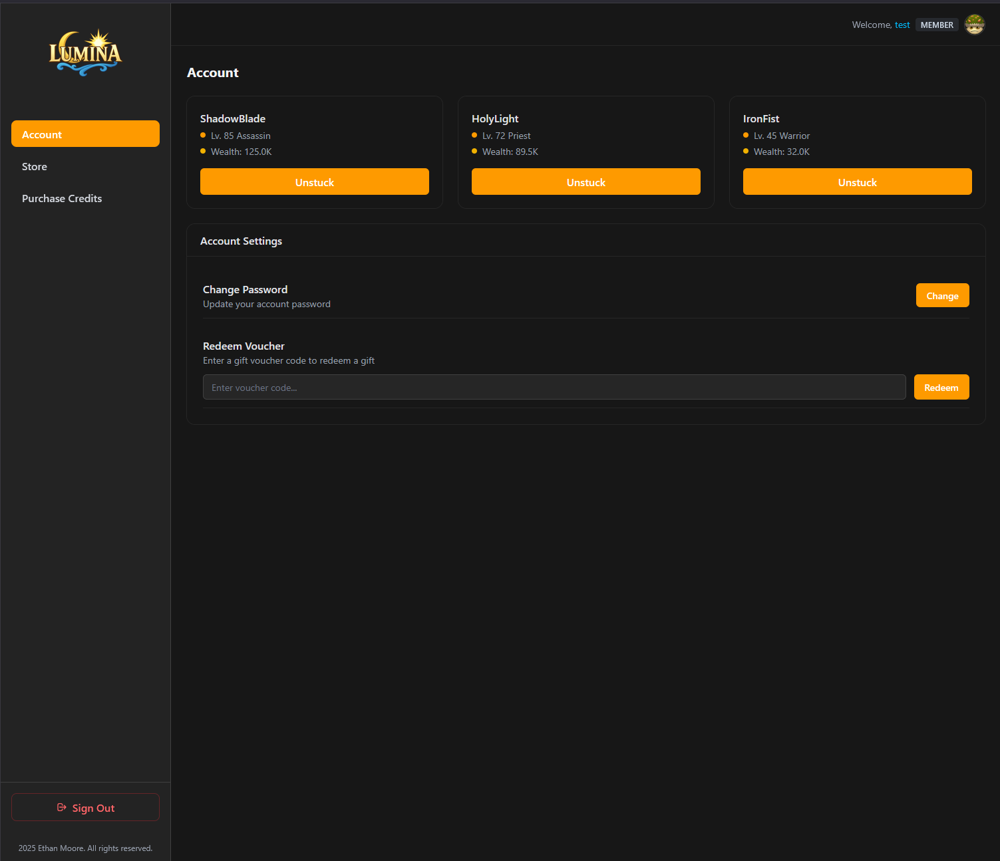
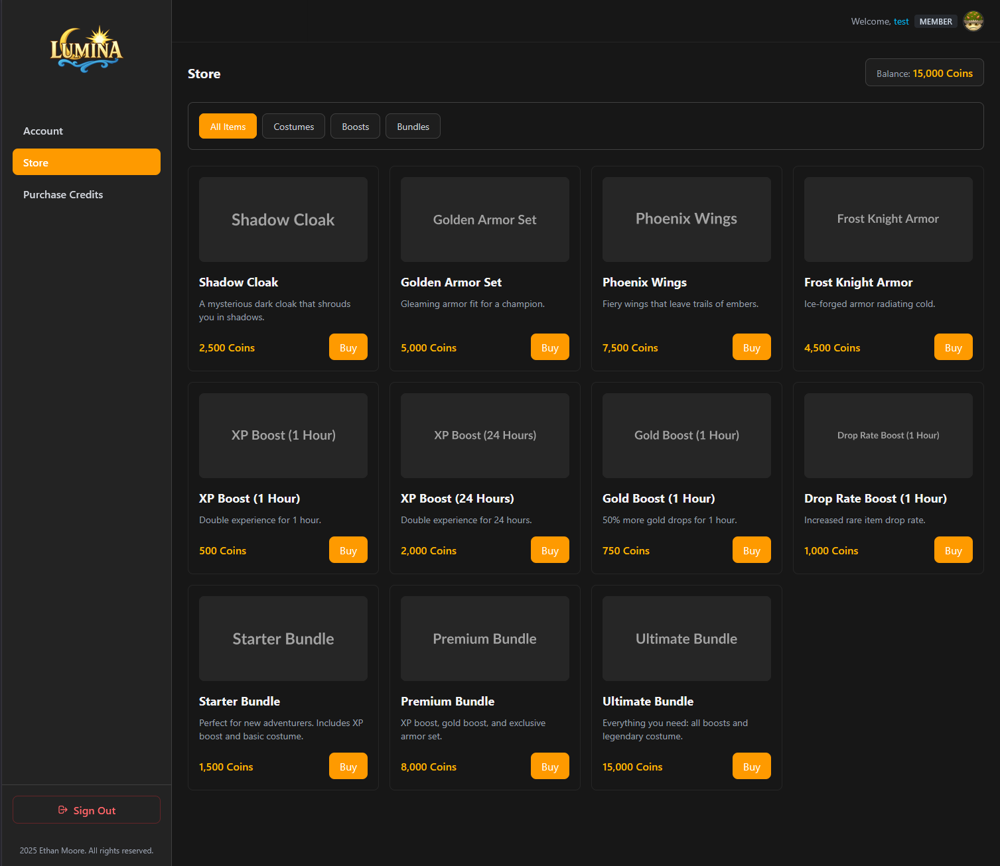
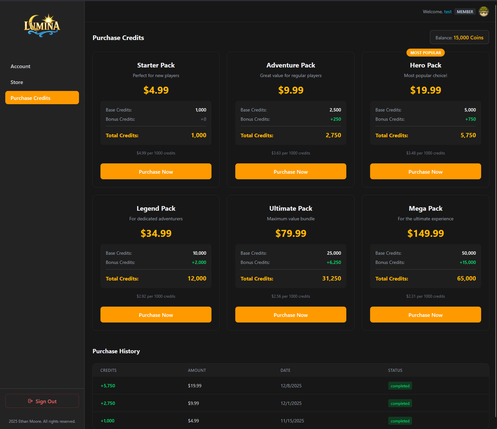

# Player Portal (SvelteKit Dashboard)

This project is a modern rewrite of a player dashboard originally built for a personal MMORPG hobby server.  
The first version was integrated into a large Astro-based site (homepage, dashboard, forums all in one).  
To make the system cleaner, more modular, and easier to maintain, the dashboard has now been rebuilt entirely in **SvelteKit** as a standalone application.

This repository represents the dedicated **Player Portal / Dashboard** portion of that ecosystem.

---

## Purpose of This Rewrite

The original monolithic Astro project grew complex as features expanded.  
This SvelteKit rewrite focuses on:

- Clean separation between features (authentication, dashboard panels, store)
- A structure optimized for future migration to a real centralized auth system
- Better maintainability and clarity across the codebase
- A dashboard system that can evolve independently from the rest of the MMORPG tooling

Even though the original concept came from a private-server project, this repo is intentionally neutral and framework-focused.

---

## Screenshots

### Account Panel

### Store Panel

### Purchase Credits Panel

---

## Current Features

### Authentication
- Username + password login  
- JWT validation from authentication server
- Protected routes  
- User state available across layouts  

### Account Panel
- Character cards displaying level, class, and wealth
- Unstuck functionality for stuck characters
- Change password option
- Voucher code redemption

### Store Panel
- Item mall with categorized items (Costumes, Boosts, Bundles)
- Filter buttons for category browsing
- Balance display with affordability check
- Disabled buy buttons when insufficient balance

### Purchase Credits Panel
- Credit package selection with bonus tiers
- Price per 1000 credits calculation
- Purchase history table with status badges
- Real-time balance display

### Visual Design
- TailwindCSS dark theme styled after classic fantasy MMO dashboards
- Responsive sidebar navigation with mobile hamburger menu
- Consistent card-based layouts
- Amber accent color scheme

---

## Asset Disclaimer

Profile avatars used in this project were generated using ChatGPT image generation,  
**loosely inspired by monster designs from Fiesta Online**.

These avatars are:
- original AI-generated artwork  
- **not official Fiesta Online assets**  
- **not owned by Gamigo, OnsOn Soft, or any Fiesta IP holder**

They are included purely for demonstration purposes inside this development project.

---

## Roadmap

Planned enhancements for future iterations of this project:

### Payment Integration
- Stripe/PayPal integration for credit purchases
- Purchase confirmation flow
- Receipt emails

### Store Features
- Item purchase functionality
- Item gifting system
- Quantity selection

### Voucher System
- Voucher code redemption
- Discount codes (percentage, fixed, bonus credits)
- Usage limits and expiration

### Account Features
- Change password endpoint

### Vote Panel
- Vote for server on ranking sites
- Vote rewards tracking
- Vote streak bonuses

---

This project is not open-source licensed and is intended for personal use and demonstration.
Feel free to adapt ideas or structures from it for your own work, but no license is granted for redistribution.

---
